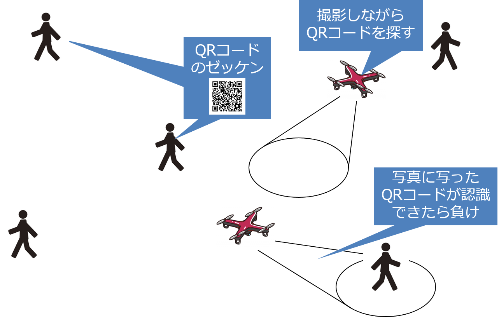

# PBL-SD-Drone＜マルチコプターによるQRコード識別システムを用いたユーザエンゲージメントの向上＞
この内容は申請書からも閲覧することができます．

チーム代表　大門雅尚

# 背景・目的
　マルチコプターは回転翼を持つ飛行体であるため，ヘリコプター等と同様に浮力のみでの空中浮揚状態の維持と前後，左右，上下への平行移動が可能である．そのため，小型かつ無人で飛行可能なマルチコプターは近年では防犯や災害分野での利用や，人間の侵入できない区域での情報収集活動等，様々な領域で活用され始めている．一方で，遊ぶことを目的とした活用はあまりなされておらず，所定のコースを飛行する速さを競うレース競技やマルチコプター同士を衝突させ合うコンバット競技等のマルチコプター同士による競技に留まっている．これらの競技は操縦者として高い操縦技術を習得する必要があり，初心者ほど競技に参加して楽しむことが困難となる．そのため，マルチコプター関連技術のユーザエンゲージメントを向上するには初心者でも楽しめるマルチコプター競技が必要となる．

# 目標
　本プロジェクトではマルチコプターと人間が競う競技を実現することで，ゲーミフィケーションによるマルチコプター関連技術へのユーザエンゲージメントを向上することを目的としている．そのための方法の一つとして，マルチコプターと人間による「隠れ鬼」遊びのルールを確立し，遊びに必要なマルチコプターを用いたシステムを開発する．

# 期待される効果
　マルチコプターによる動体の識別は新たな無人航空機活用手段へのベースラインとして期待できる．また，マルチコプターを活用した新たな遊びを実現することで，世間からのマルチコプター関連技術活用に対する敷居を下げ，ユーザエンゲージメントを高めることに繋がると考えられる．

# 内容
　本プロジェクトではジンバルカメラを搭載したマルチコプターが撮影する写真を用いて，移動する人物に取付けたQRコードをリアルタイムに識別するシステムを開発する．さらに，開発したシステムを用いて，マルチコプターと人間による「隠れ鬼」遊びを実現する．また，「隠れ鬼」遊びを実現するに当たって，手動操縦の簡易化を行う．

